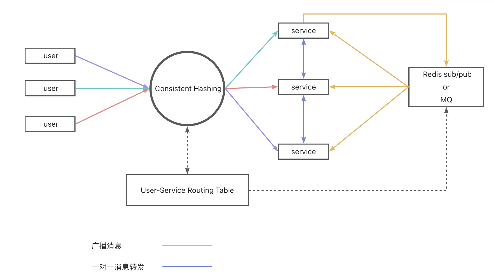

# Websocket Cluster

Websocket 集群的 Java 实现。
该方案不考虑持久化任何消息，仅作为 Websocket 消息转发的一种参考方案。

## 功能

* 路由表
* 一对一单聊
* 广播

## 架构

1. Websocket 连接使用一致性哈希算法计算路由，并将路由信息注册到路由表。
2. 服务之间直接转发消息实现一对一消息发送。不使用 MQ、Redis 转发的原因是为了避免动态增删 topic 或 queue。
3. 使用订阅/发布模式实现消息广播。